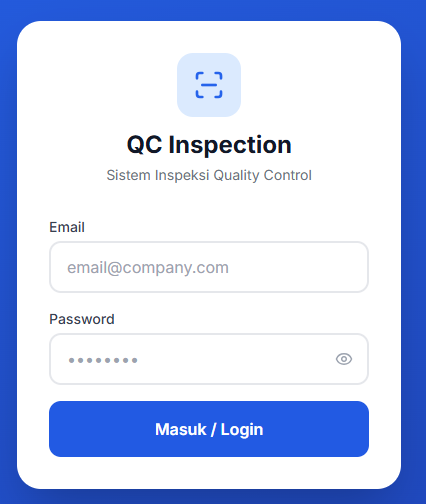
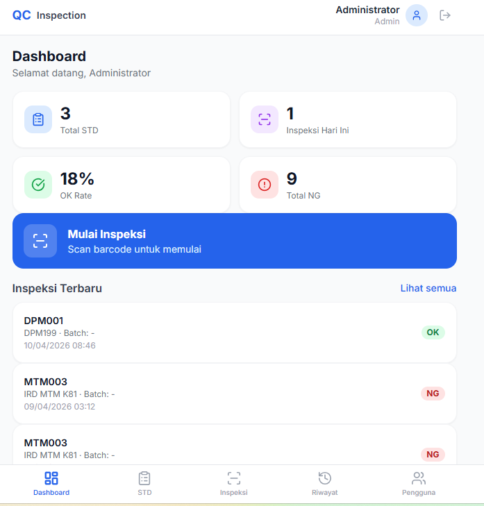
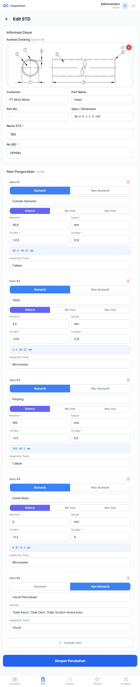
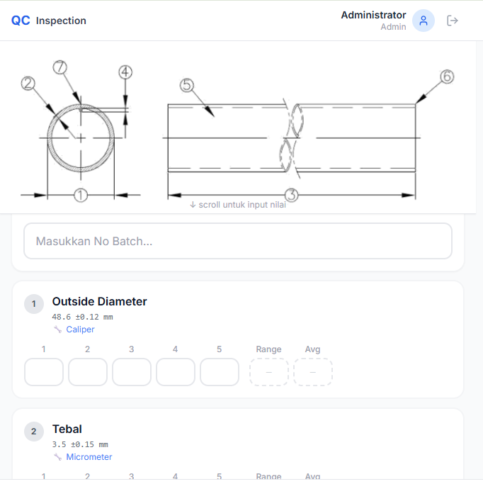
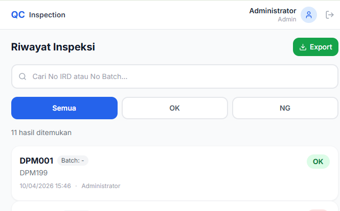
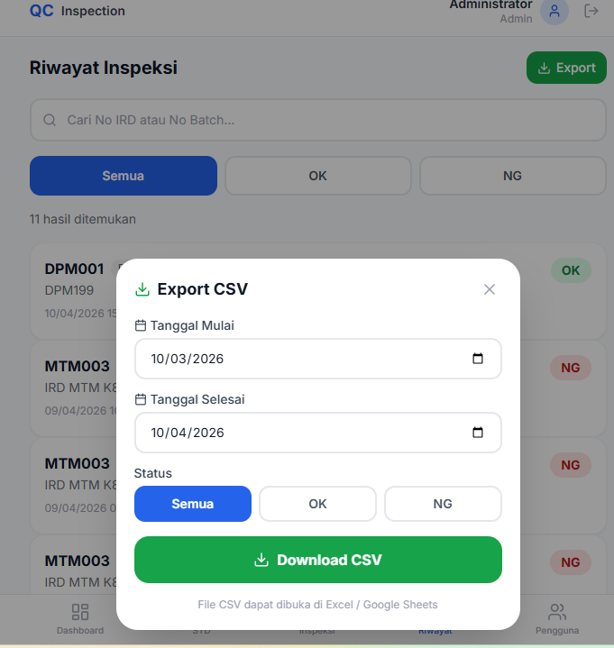

# Panduan Membuat Portfolio GitHub (Tanpa Source Code)

> Step-by-step membuat repo portfolio untuk showcase project web app di GitHub.

---

## Step 1 — Buat Folder Terpisah

Buat folder baru khusus untuk repo portfolio — **tidak mengandung source code**.

```bash
mkdir "portofolio github"
cd "portofolio github"
```

---

## Step 2 — Siapkan Screenshot

Buka webapp di **HP** (supaya tampilan mobile-first), lalu screenshot halaman-halaman utama.

Contoh screenshot yang dibutuhkan:

| File | Halaman |
|------|---------|
| `login.png` | Halaman login |
| `dashboard.png` | Dashboard |
| `std-create.png` | Form input utama |
| `inspection.png` | Fitur utama saat dipakai |
| `history.png` | Halaman riwayat / data |
| `export.png` | Fitur export (opsional) |

Taruh semua di folder `screenshots/`:

```bash
mkdir screenshots
# copy semua file .png ke folder screenshots/
```

---

## Step 3 — Buat README.md

Buat file `README.md` dengan struktur berikut:

```markdown
# Nama Aplikasi

> Deskripsi singkat 1 baris (ID & EN)

**Live Demo:** [link-demo](https://link-demo)

---

## Screenshots

<!-- Grid 3 kolom, atur width sesuai kebutuhan -->
<p align="center">
  
  
  
</p>
<p align="center">
  
  
  
</p>

---

## Overview
Jelaskan apa aplikasinya, untuk siapa, masalah apa yang diselesaikan.

## Features / Fitur
List fitur utama — per fitur jelaskan singkat.

## Role-Based Access
Tabel hak akses per role (jika ada).

## Tech Stack
Tabel teknologi yang dipakai.

## User Flow / Alur Penggunaan
Step 1, 2, 3 — jelaskan alur dari sisi user.

## Deployment
Platform, database, storage yang dipakai.

## Contact
Nama, GitHub, link demo.
```

### Tips Bilingual

Tulis `**[ID]**` dan `**[EN]**` per section, bukan halaman terpisah:

```markdown
## Overview

**[ID]**
QC Inspection adalah aplikasi web untuk proses pengecekan kualitas produk.

**[EN]**
QC Inspection is a web application for product quality checking.
```

---

## Step 4 — Init Git & Push ke GitHub

### 4a. Init repo lokal

```bash
git init
git branch -m main
git add -A
git commit -m "docs: Nama Aplikasi portfolio"
```

### 4b. Buat repo di GitHub

1. Buka **https://github.com/new**
2. Nama repo: `Nama-Aplikasi-Web-App`
3. Pilih **Public**
4. **JANGAN** centang "Add a README file"
5. Klik **Create repository**

### 4c. Hubungkan & push

```bash
git remote add origin https://github.com/username/Nama-Aplikasi-Web-App.git
git push -u origin main
```

---

## Step 5 — Cek Hasil

Buka `https://github.com/username/Nama-Aplikasi-Web-App`

README akan langsung tampil dengan screenshot grid dan deskripsi lengkap.

---

## Step 6 — Update (Jika Ada Perubahan)

Jika ada screenshot baru atau update deskripsi:

```bash
git add -A
git commit -m "docs: update screenshot dan deskripsi"
git push
```

---

## Tips Portfolio GitHub

| Tips | Penjelasan |
|------|------------|
| Jangan include source code | Repo ini khusus showcase, bukan development |
| Screenshot dari HP | Lebih menarik untuk webapp mobile-first |
| Sertakan Live Demo link | Recruiter/client bisa langsung coba |
| Bilingual (ID/EN) | Jangkauan lebih luas |
| Pakai `` | Bisa atur ukuran & grid (vs `` yang tidak bisa) |
| 1 repo per project | Lebih rapi daripada 1 repo berisi semua project |
| Gunakan emoji sparingly | Boleh di heading tapi jangan berlebihan |
| Tambahkan tabel | Tech stack dan role access lebih rapi dalam tabel |

---

## Struktur Folder Akhir

```
portofolio github/
├── README.md              # Portfolio showcase
├── GUIDE.md               # Panduan ini
└── screenshots/
    ├── login.png
    ├── dashboard.png
    ├── std-create.png
    ├── inspection.png
    ├── history.png
    └── export.png
```
